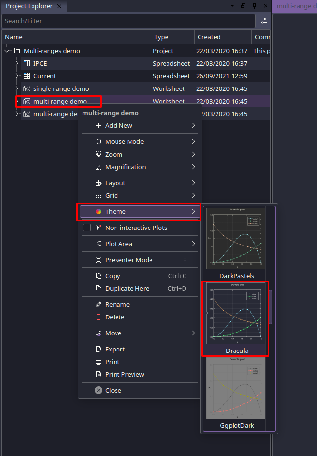
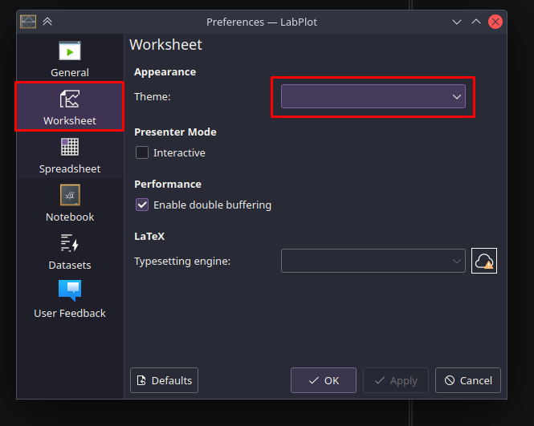

### [Labplot](https://labplot.kde.org/)

#### General

Theming the whole application consists of 3 parts:

- Worksheet theme (The actual plot area. How your plots look like when published).
- Application theme (How the app itself looks)
  - LabPlot on Linux systems with KDE Desktop attempts to use the OS installed application themes, so manual installation might be neccessary, if you don't want to install Dracula OS wide.
- Colormap (Used only for spreadsheet highlighting at the moment).

All of them are included in Labplot' source and can be used without manual installation starting with version `2.11.0`.

#### Installing manually

##### Download using Git

If you are a git user, you can download the theme by cloning the repo:

```bash
git clone https://github.com/dracula/labplot.git
```

##### Download manually

Download using the [GitHub `.zip` download](https://github.com/dracula/labplot/archive/master.zip) option and unzip them.

#### Activating worksheet theme

The worksheet theme is already included in all LabPlot installations starting with version `2.11.0`, Commit `46d4de1`

1. In the Project Explorer, right click on the worksheet that you want to style
2. Click on "Theme"
3. Scroll down and select the "Dracula" Entry



To set this as deafult:

1. Open up the "Settings" menu in the menubar
2. Hit "Configure LabPlot.."
3. Go to the "Worksheet" Tab
4. Select "Dracula" from the "Theme" dropdown




#### Activating Application theme

TBD

#### Activating Colormap

TBD
