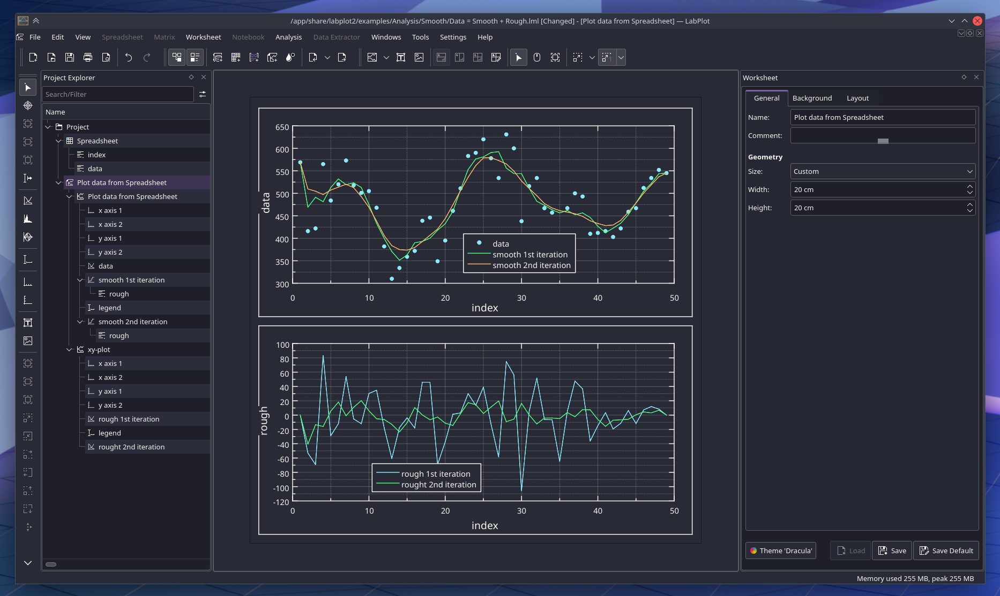

# Dracula for [LabPlot](https://labplot.kde.org/)

> A dark theme for [LabPlot](https://labplot.kde.org/).

## Install

All instructions can be found at [draculatheme.com/labplot](https://draculatheme.com/labplot). (As wall as in [`./INSTALL.md`](https://github.com/dracula/labplot/blob/main/INSTALL.md))

## Team

This theme is maintained by the following person(s) and a bunch of [awesome contributors](https://github.com/dracula/gitlab/graphs/contributors).

|     |
| ------------------------------------------------------------------------------------------------ |
| [Chrismettal](https://github.com/chrismettal)                                                    |

## Community

- [Twitter](https://twitter.com/draculatheme) - Best for getting updates about themes and new stuff.
- [GitHub](https://github.com/dracula/dracula-theme/discussions) - Best for asking questions and discussing issues.
- [Discord](https://draculatheme.com/discord-invite) - Best for hanging out with the community.

## License

[MIT License](./LICENSE)
